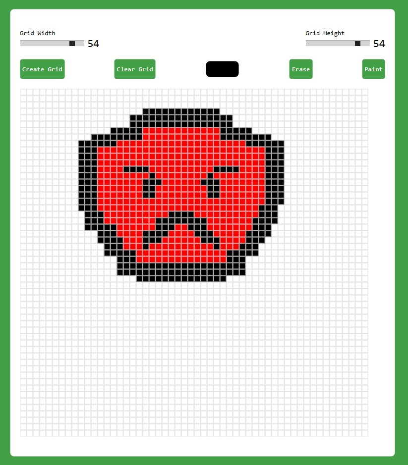

🧮 NYG Pixel Art gGnerator

Basic pixel art generator with pixel control.

📸 Preview

</img>

✨ Features

- 🎨 Pixel art editor — create designs directly on a grid
- 📏 Adjustable grid size — customize up to 64x64 pixels
- 🖌️ Paint tool — draw freely with selected colors
- 🧽 Erase tool — remove pixels easily
- 🎯 Color picker — choose and apply colors dynamically
- 🆕 Create grid — generate a new canvas instantly
- 🗑️ Clear grid — reset the entire drawing with one click

🛠️ Built With

![HTML5]
![CSS3]
![JavaScript]

📁 Project Structure

NYG-Calculator/  
├── index.html     → Page structure  
├── style.css         → Visual styling  
├── script.js           → Generator Logic  
└── [README.md](http://readme.md/)  → Project documentation

👤 Author

**Yuri** — [@NyG007](https://github.com/NyG007)